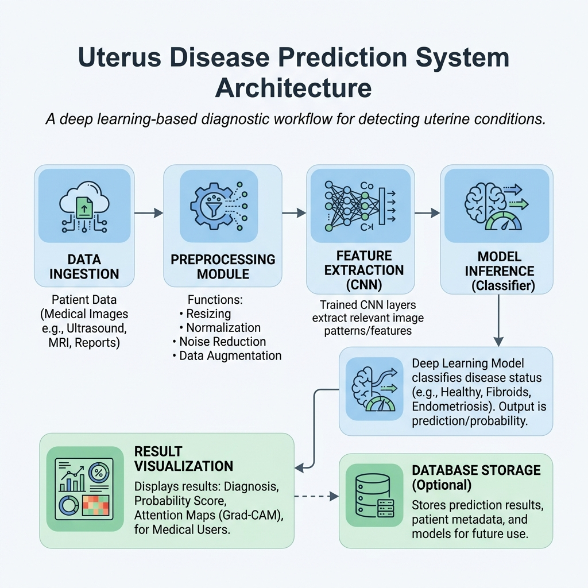
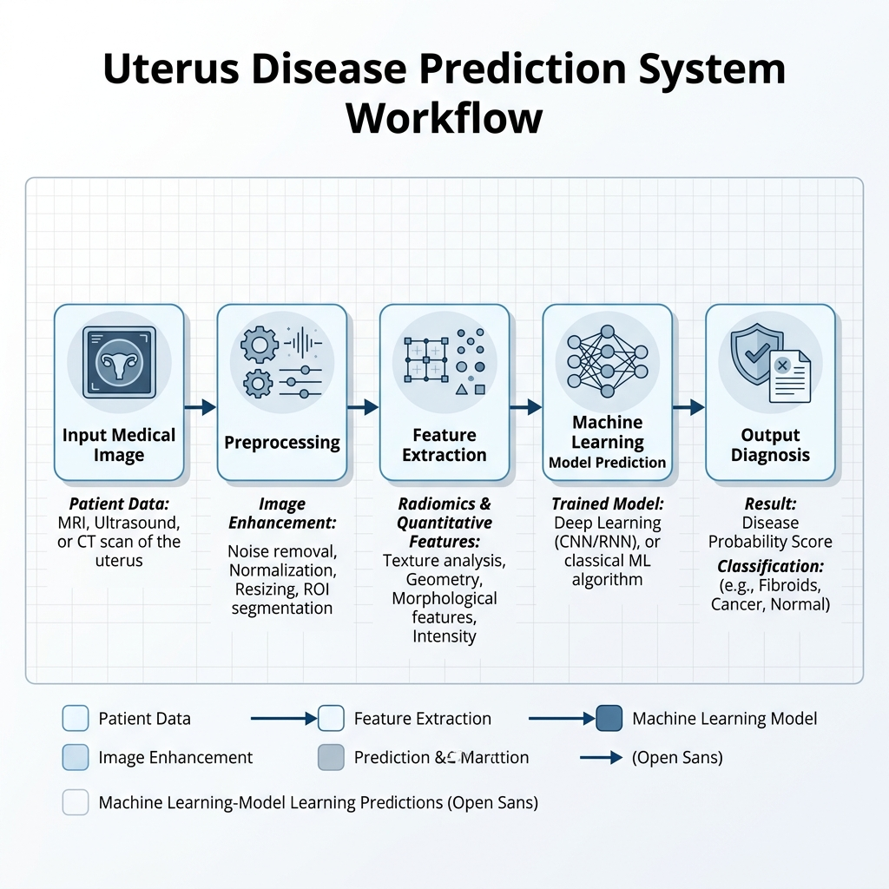
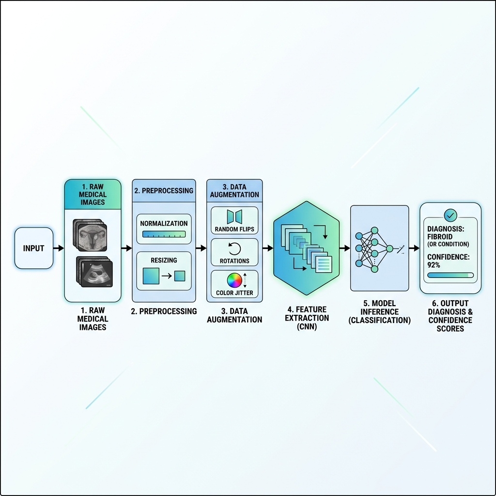

# Uterus Disease Prediction System

A machine learning-based system designed to assist medical practitioners in the diagnosis of uterine diseases from imaging data (ultrasound and MRI). By automating the image processing, feature extraction, and classification pipeline, the system aims to provide fast, reliable, and interpretable diagnostic assistance.

---

## 📸 System Architecture & Workflows

### 1. System Architecture
The overall architecture of the system connects user interface/image ingestion down to database storage and diagnostic reports.



### 2. End-to-End Workflow
The pipeline processes incoming scans sequentially to generate a clinical suggestion:



### 3. Detailed Data Flow
How data transforms from a raw medical image into predictive features and final confidence scores:



---

## 🔍 How It Works

1. **Data Ingestion**: Raw scans (ultrasound or MRI) are fed into the system.
2. **Pre-processing**: Noise reduction filters, contrast adjustment, and resizing normalize input images.
3. **Feature Extraction**: Convolutional Neural Networks (CNNs) extract high-level spatial features from the scans.
4. **Model Inference**: Deep learning classifiers or alternative ML models (e.g., Random Forest) evaluate feature vectors to predict disease categories (e.g., normal, fibroids, polyps, cysts).
5. **Report Generation**: Outputs a structured report with confidence scores and prediction summaries.

---

## 🛠️ Installation & Setup

### Prerequisites
- Python 3.8+
- Git

### Steps
1. **Clone the Repository**
   ```bash
   git clone https://github.com/sivatha321/Uterus-Disease-Prediction-System.git
   cd Uterus-Disease-Prediction-System
   ```

2. **Set up Virtual Environment**
   ```bash
   # Create a virtual environment
   python -m venv venv

   # Activate the environment
   # On Windows:
   venv\Scripts\activate
   # On macOS/Linux:
   source venv/bin/activate
   ```

3. **Install Dependencies**
   ```bash
   pip install -r requirements.txt
   ```

---

## 🚀 Usage

To run a prediction on a medical image scan:
```bash
python predict.py --image path/to/image.png
```

For using the Random Forest classifier:
```bash
python rf_predict.py --image path/to/image.png
```

---

## 🤝 Contributing

Contributions are highly appreciated! 
1. Fork this repository.
2. Create a feature branch (`git checkout -b feature/NewFeature`).
3. Commit your changes (`git commit -m 'Add some NewFeature'`).
4. Push to the branch (`git push origin feature/NewFeature`).
5. Open a Pull Request.

---

## 📄 License

This project is licensed under the MIT License.
